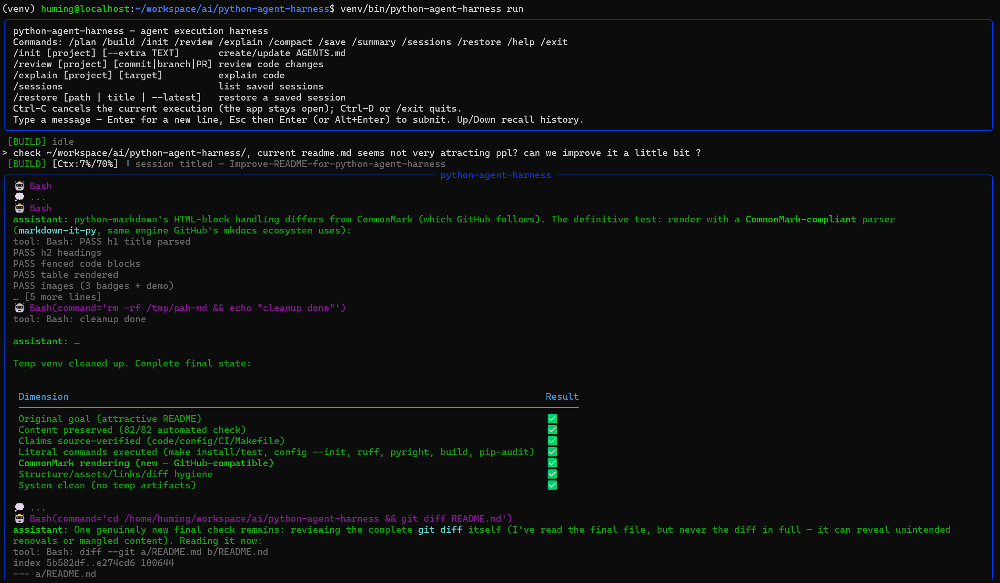

# python-agent-harness

A Python port of the Emacs [gptel-agent-harness](https://github.com/beacoder/gptel-agent-harness): a minimal-dependency coding agent designed for daily use and easy customization.

## Features

- **FSM-driven agent execution with completion supervision** — the run is
  driven by a finite state machine (WAIT/TOOL/TRET/SUPERVISE/DONE/ERRS/
  ABRT); the model is nudged (max 2) when it tries to stop before the task
  is complete; the nudge counter resets on tool calls; tool results are
  sanitized so a failed call never strands the machine.
- **API retry with backoff** — transient failures (HTTP 429 / 5xx, connection
  errors) are retried automatically with exponential backoff + jitter
  (honoring `Retry-After`), so a rate limit or a dropped connection no longer
  kills the run; retries never duplicate streamed output and a Ctrl-C aborts
  the backoff wait promptly. Permanent errors (other 4xx) fail fast.
- **Context management** — CJK-aware token estimation, per-model context
  windows (deepseek-v4/glm-5.2 1M, gpt-5 400k, kimi-k2.7 256k, claude 200k,
  ...), self-calibrating estimates from API-reported input tokens, and
  automatic compaction at 70% usage that summarizes the conversation and
  resumes with the last user request.
- **Tools** — Agent (sub-agents), TodoWrite, Glob (git-aware), Grep
  (git grep → rg → grep), Read, Insert, Edit (incl. unified diffs), Write,
  Mkdir, Bash, Skill, Question, and PlanExit (registered while in plan
  mode) — all OpenAI-compatible tool schemas.  Tool execution mirrors
  gptel's `gptel--handle-tool-use`: synchronous tools (Read, Edit,
  Glob, ...) run ONE AT A TIME in model-emitted order, while the
  asynchronous tools (Bash, Agent) are dispatched and run concurrently
  in the background — results are delivered in the original call order.
- **Default agent prompts** — the main agent and sub-agents each get a
  distinct default system prompt bundled with the package
  (`prompts/agent.md`, `prompts/subagent.md`), with YAML frontmatter
  stripped and the `{{SKILLS}}` placeholder filled from the discovered
  skill directory. The main prompt is prefixed with the project context
  files and the task-completion rules; sub-agents get only their own
  prompt. `/init` `/review` `/explain` and custom commands
  (`prompts/commands/*.md`) run with their own prompt for that run.
- **Plan / Build modes** — plan mode is read-only except the per-session
  plan file; PlanExit switches back to build with an "execute the plan"
  prompt; sub-agents in plan mode receive the read-only reminder.
- **Sessions** — auto-saved after every response to
  `~/.local/share/python-agent-harness/sessions/`, LLM-generated titles
  (one-shot per session, fired when the agent run finishes; the file is
  renamed to `<title>_<TS>.md`), `/restore` (with `--latest`) and
  `/sessions` TUI commands.
- **Commands** — `/init` (create/update AGENTS.md), `/review` (uncommitted
  changes / commit / branch / PR), `/summary`, `/explain` and custom
  commands from `prompts/commands/*.md` — all TUI slash commands.
  Tool availability: `/init`/`/review` may use **all
  tools except PlanExit** (the PlanExit tool is hidden for the run,
  including for spawned sub-agents); custom commands may use all tools
  including PlanExit; `compact`/`summary` run with **no tools** (a
  one-shot `chat_sync` call, like session-title generation).
- **Editing input** — `prompt_toolkit`-backed multi-line editor with
  persistent history (Up/Down recall), Enter for a newline, Esc+Enter
  (or Alt+Enter) to submit, and **Tab completion** (Tab to complete,
  Shift+Tab to cycle backwards): the first token starting with `/`
  completes against the slash commands (builtins + custom
  `prompts/commands/*.md`); after a slash command's space, Tab
  completes paths relative to the project dir (absolute and `~` paths
  work too; directories get a trailing `/` to keep drilling).  In plain
  messages, any token containing `/` or starting with `~` (e.g.
  `~/wor`, `docs/`) completes as a path the same way — `~` against
  `$HOME`, otherwise relative to the project dir — so `~/wor` + Tab
  becomes `~/workspace/`.
- **TUI** — rich live interface with a pinned status bar (mode, context
  usage, spinner), streaming assistant output, tool-result previews, a
  pinned Todos panel (sub-agent lists shown with a `sub:` label), and
  numbered-choice questions for Question tool / PlanExit confirmations.
- **Diff rendering** — Edit/Write tool calls capture a unified diff of
  the file change and render it inline (red/green) in the TUI, so file
  edits are visible without leaving the app.

## Screenshot



## Install

```sh
python -m venv venv
venv/bin/pip install rich httpx prompt_toolkit
venv/bin/pip install -e python-agent-harness
```

## Configuration

LLM settings live in a JSON config file — no environment variables needed:

```sh
python-agent-harness config --init        # write ~/.config/python-agent-harness/config.json
python-agent-harness config               # show effective settings (API key masked)
```

Edit `~/.config/python-agent-harness/config.json`:

```json
{
  "llm": {
    "base_url": "https://api.deepseek.com/v1",
    "api_key": "sk-...",
    "model": "deepseek-chat",
    "reasoning_effort": "medium",
    "stream": true
  },
  "paths": {
    "context_path": null,
    "skill_path": null
  }
}
```

`reasoning_effort` is passed to the API as-is (omitted when unset), so you
can use whatever your provider accepts ("low"/"medium"/"high" for OpenAI
and compatible providers). Other optional keys: `backend`, `temperature`,
`max_tokens`, `timeout`, `stream` (`true` by default; set `false` for
non-streaming one-shot responses — `python-agent-harness run --no-stream`
overrides it on the command line). The `paths` object (`context_path`,
`skill_path`) overrides the context/skill directory discovery — defaults
are `<project>/contexts` or `~/.emacs.d/contexts` for context files, and
`<project>/skills` or `~/.emacs.d/skills` for skills.

Precedence: code defaults < config file < `OPENAI_*` environment variables
(env still wins if you set them, but nothing is required).  Use a custom
file with `--config PATH` (also settable via `PYTHON_AGENT_HARNESS_CONFIG`).

LLM request/response bodies are logged as JSON to
`/tmp/python-agent-harness-<date>-<id>.json` (override the directory with
`LLM_LOG_DIR`); the path is printed at TUI startup.

## Usage

```sh
python-agent-harness run [project-dir]   # interactive TUI agent
```

TUI slash commands: `/plan` `/build` `/init` `/review` `/explain`
`/compact` `/save` `/summary` `/sessions`
`/restore` `/clear` `/exit` — `/explain [project] [target]` explains
code and `/summary` appends a conversation summary (both TUI-only);
`/sessions` lists saved sessions and `/restore [path|title|--latest]`
restores one (`/restore` matches sessions by title substring). Custom
commands from `prompts/commands/*.md` are TUI slash commands too
(TUI-only — no CLI subcommand is registered for them).

Input editing: type your message, press **Enter** for a new line, and
**Esc then Enter** (or **Alt+Enter**) to submit. **Up/Down** recall
previous inputs from `~/.local/share/python-agent-harness/input_history`.
**Ctrl-D** quits; **Ctrl-C** cancels the current input or agent run
without leaving the app — the conversation history is preserved, so you
can immediately ask a follow-up question; a cancelled worker can never
clobber the next run's state (per-run cancellation identity).

## Layout

```
python_agent_harness/
├── agent.py        agent FSM (states, transitions, supervision, compaction)
├── client.py       OpenAI-compatible streaming client (httpx)
├── models.py       Message / ToolCall / ToolSpec data classes
├── token_estimator.py  CJK-aware token estimation + calibration
├── planmode.py     build/plan mode + plan file lifecycle
├── prompts.py      prompt loading + system prompt assembly
├── session_store.py  session persistence + titles
├── agent_session.py  AgentSession (wiring hub)
├── subagent.py     sub-agent runner (error containment, plan reminder)
├── commands.py     init/review/custom command definitions
├── cli.py          argparse entry points
├── tui.py          rich + prompt_toolkit TUI
├── diffrender.py   unified diff generation + rich rendering
└── tools/          tool implementations + registry
```

## Tests

```sh
venv/bin/python -m unittest discover -s tests -v
```

Python ≥ 3.11 is required (CI runs 3.11 / 3.12 / 3.13).

## Verification checklist (ported semantics)

- [x] Nudge supervision with fail-closed dead-session budget
- [x] Tool-result sanitization (None → error placeholder)
- [x] Compaction: frame, resume last request
- [x] Plan mode: read-only + plan-file writes only
- [x] Bash: Ctrl-C process-group kill
- [x] Session metadata round-trip and title sanitization
- [x] One-shot LLM title generation after the agent run finishes
- [x] Ctrl-C cancel: stale workers can't clobber the next run's history
